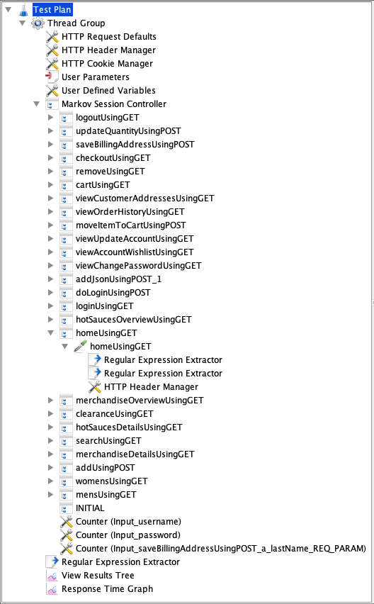
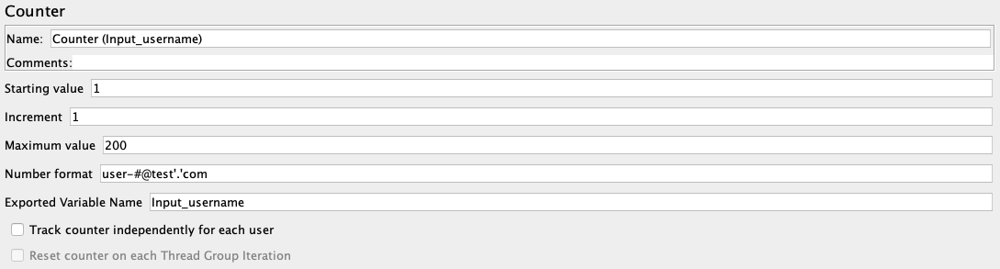
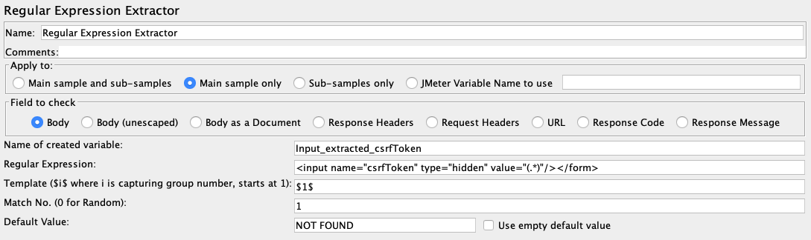
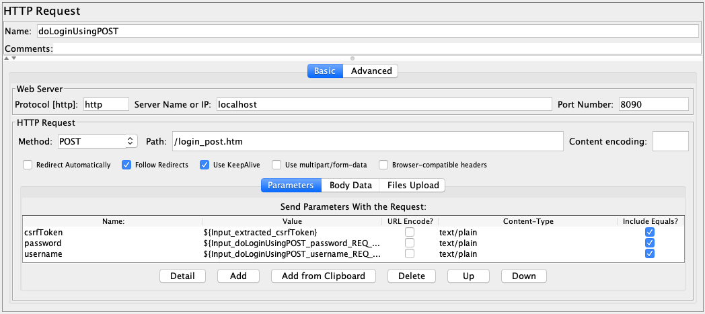

*[Back to contents](../README.md)*

## 4. Generating a Parameterized Load Test

At this point, we are set for generating load tests automatically. For this, we only need to pass monitored requests to ContinuITy and it will transform the requests to session logs, extract a Markov-chain-based workload model using [WESSBAS](TODO), transform it to a [JMeter](TODO) load test, and parameterize the load test with the stored IDPA. This can be done with the following steps.

1. ContinuITy can process so-called *orders*. Hence, we need to create and submit one that will result in the generated and parameterized load test. For convenience, we change the CLI context with the command ```order```, which should change the prompt to the following:
```
continuity/order (heat-clinic):>
```

2. Then, we create a new order with the command ```create```.

3. A file ```order.yml``` will open, which is already prefilled with several properties. We only need some of them: ```goal``` defines the type of artifact that should result from the order. The ```mode``` defines to use recorded sessions. The ```tag``` needs to be similar to the tag we set previously when creating the IDPA. In ```options```, several further options of the order such as the workload model and load test type need to be defined. Finally, ```source``` defines the data based on which the load test is to be generated. We provide session logs to be used in this demo, which are stored in the folder ```session-logs``` and are already mounted into the ContinuITy tool. Thus, we simply can link it in the order. We need to specify all properties and remove the unused ones, resulting in the following:
```yaml
---
goal: create-load-test
mode: past-sessions
tag: heat-clinic
options:
  workload-model-type: wessbas
  load-test-type: jmeter
source:
  session-logs:
    link: session-logs/sessions/_persisted_1-heat-clinic
```

4. After the order has been defined, we need to go back to the CLI and send it to ContinuITy with the command ```submit```. The output will be:
```yaml
Submitted the order, storage ID is 1-create-load-test-heat-clinic. For further actions:
---
wait-link: http://localhost:8080/order/heat-clinic-1/wait
result-link: http://localhost:8080/order/heat-clinic-1/result
num-reports: 1
```

5. An order such as the just submitted one can take a while for being processed. Therefore, it is processed asynchronously. In the output, it can be seen that there is a link that can be used for waiting for the result of the order. There is also a corresponding CLI command, which can be parameterized with a timeout in milliseconds (default is 1000). Hence, if we would like to wait 10 seconds for the response of the order, we need to execute
```
wait 10000
```

6. When the result is ready (reexecute the ```wait``` command, if the order was not finished yet), a report about all created artifacts will be returned, such as below. It can be seen that several artifacts have been created (```created-artifacts```), including a JMeter load test.
```yaml
---
order-id: heat-clinic-1
number: 1
max: 1
successful: true
created-artifacts:
  session-logs:
    link: http://localhost:8080/sessions/_persisted_1-heat-clinic
  workload-model:
    type: wessbas
    link: http://localhost:8080/workloadmodel/wessbas/model/heat-clinic-1
  load-test:
    type: jmeter
    link: http://localhost:8080/loadtest/jmeter/test/heat-clinic-1
  sessions-bundles:
    status: changed
internal-artifacts:
  tag: heat-clinic
  session-logs:
    link: session-logs/sessions/_persisted_1-heat-clinic
  workload-model:
    type: wessbas
    link: wessbas/model/heat-clinic-1
    jmeter-link: wessbas/jmeter/heat-clinic-1
    behavior-link: wessbas/behavior/heat-clinic-1
    application-link: wessbas/model/heat-clinic-1/application
    initial-annotation-link: wessbas/model/heat-clinic-1/annotation
  load-test:
    type: jmeter
    link: jmeter/loadtest/heat-clinic-1
  sessions-bundles:
    status: changed
```

7. The final step is to download and open the created load test. For this, we need to copy the URL at position ```created-artifacts.load-test.link``` and use it with the following command:
```
jmeter download http://localhost:8080/loadtest/jmeter/test/heat-clinic-1
```

The result will be that the load test is opened in JMeter. You can have a look at the test and inspect its elements. On the left hand side, the tree-based structure of the test is shown:



The main elements are
* the *Thread Group*, which defines how many concurrent users are to be executed during which time period
* the *Markov Session Controller*, which controls the order of requests per user
* several request definitions labeled with the endpoint ID, e.g., *homeUsingGET*
* several configuration elements, such as *User Defined Varaibles*, *Counters*, or *Regular Expression Extractors*.

The parameterizations defined in the IDPA can be found in the different JMeter load test elements. For instance, the *inputs* we defined in [step 2](2_annotation.md) have been transformed to a *Counter* and a *Regular Expression Extractor* as child of the *homeUsingGET* request:





The mappings defined in the *parameter-annotations* are reflected in the parameter definitions of the *doLoginUsingPOST* request:




***[Continue with the next step...](5_evolution.md)***